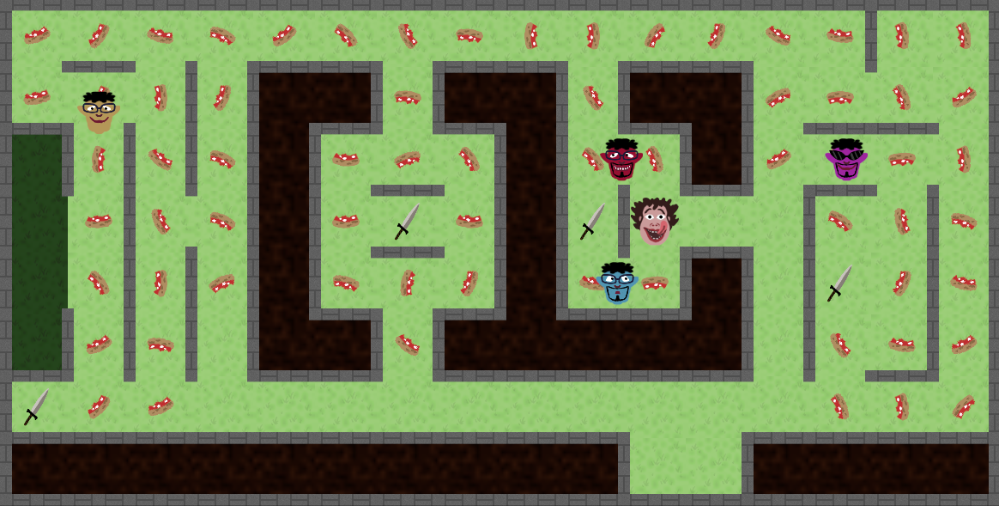

# Nikman



Nikman is a 2D maze game for PC that you can play with a friend (or a foe), done with C++ and OpenGL.

The design is inspired by Amazin' SPISPOPD, a classic indie game by Hamumu Software.

## How to play

Move with arrows or WASD.
Eat the pizza crusts.
Avoid evil jemels.

## Installation

### Windows (installer)

The easiest way to install Nikman under windows is to download the installer from [itch.io](https://itch.io), here: https://stal12.itch.io/nikman.

### Linux, Windows (from source)

Alternatively, you can build Nikman from source.

You need:

- [CMake](https://cmake.org/) 3.17.1 or higher
- A C++ compiler supporting C++17
- [GLFW](https://www.glfw.org/), to create the window and receive inputs
- [SFML](https://www.sfml-dev.org/) (audio module only), for sounds and music
- A graphic processor driver implementing OpenGL 3.3 or higher

Other 3rd party software already included in the repository:

- [Glad](https://glad.dav1d.de/)
- [stb_image](https://github.com/nothings/stb)

#### Instructions

1) Clone the repo.
2) Run CMake, choose the `build` directory, configure, generate.
4) Compile.
5) Run Nikman.

In order to also build the installer (MSVC only):

6) Inside the `build` directory, run `comandi.bat`

## Customization

### Levels
You can add custom levels in the game, by editing files in the `resources/levels` directory, in the source or directly in the installation folder.

If you installed the game in the default path, you may face problems of missing write permission; fear not, and show your computer who's in charge here!

For those who master Italian, the instructions for levels editing are detailed in `other/libellids/istruzioni.txt`. The others can just learn from the examples, it is a fairly easy format.

For convenience, the script `other/libellids/init_maze.py` initializes an empty level of the chosen size.

For instance, this is the first level:

```
+---+---+---+---+---+---+---+---+---+---+---+---+---+---+---+---+
|                                                       |       |
+   +---+   +   +---+---+   +---+---+   +---+---+   +   +   +   +
|           |   | m   m |   | m   m |   | m   m |               |
+---+   +   +   +   +---+   +---+   +   +---+   +   +---+---+   +
| h |   |   |   | m |           | m |       | m |               |
+   +   +   +   +   +   +---+   +   +   +   +---+   +---+   +   +
| h     |       | m |     w     | m | w |           |       |   |
+   +   +   +   +   +   +---+   +   +   +   +---+   +   +   +   +
| h     |   |   | m |           | m |       | m |   | w     |   |
+   +   +   +   +   +---+   +---+   +---+---+   +   +   +   +   +
| h |   |   |   | m   m |   | m   m   m   m   m |   |       |   |
+---+   +   +   +---+---+   +---+---+---+---+---+   +   +---+   +
| w                                                             |
+---+---+---+---+---+---+---+---+---+---+   +   +---+---+---+---+
| m   m   m   m   m   m   m   m   m   m | n   s | m   m   m   m |
+---+---+---+---+---+---+---+---+---+---+---+---+---+---+---+---+
```

### Other
Of course, you can also mod the game in other ways, like changing the textures, sounds and font.

Just replace the files in the `resources` folder with your own.

## Credits

- Artist: **Davide Papazzoni** (@itspapaz on social media)
- Level designer: **Nicola Baldini**
- Sound engineer: **Lorenzo Governatori**

Other credits are listed in `CREDITS`.

## License

Nikman is released under the MIT license, detailed in `LICENSE`.
